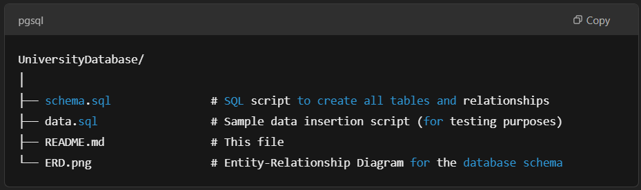

# University Database Project

This project implements a relational database system for managing university data, including students, courses, professors, departments, and enrollments. The database schema is designed to store and query information about university courses, student enrollments, professor assignments, classroom schedules, and prerequisites.

## Features

- **Students**: Track student information, including IDs, names, department affiliations, and total credits earned.
- **Courses**: Store course details such as course IDs, titles, and credits.
- **Departments**: Information on university departments, including their name, building, and budget.
- **Enrollments**: Store the courses that students are enrolled in, including grades and semester data.
- **Professors**: Manage professor data including their names, departments, and salary information.
- **Advisors**: Track advisor assignments for each student.
- **Classrooms**: Maintain classroom information, including room number, building, and capacity.
- **Prerequisites**: Record course prerequisites to maintain course dependencies.
- **Schedules**: Track course schedule information such as time slots and semester data.

## Database Schema

The database schema is designed as follows:

- **Student**: Contains information about students.
- **Course**: Contains information about the courses offered by the university.
- **Department**: Stores department-related data, including the department name and budget.
- **Instructor**: Stores professor data, including their department and salary.
- **Classroom**: Stores classroom information, including capacity and room number.
- **Section**: Tracks different course sections offered in a given semester.
- **Enrollment**: Tracks which students are enrolled in which courses.
- **Advisor**: Stores advisor information and links professors to students.
- **Time_Slot**: Stores information about when courses are scheduled.
- **Teaches**: Links instructors to the courses they teach.
- **Prereq**: Contains course prerequisites.

## File Structure



## Installation

1. Clone the repository:
    ```bash
    git clone https://github.com/yourusername/university-database.git
    cd university-database
    ```

2. Set up the database:

   - Use the provided `schema.sql` file to create the database schema. You can run this script on your preferred SQL database management system (MySQL, PostgreSQL, etc.).
   
    ```sql
    source schema.sql;
    ```

3. Insert sample data (optional):

   - You can run the `data.sql` file to insert sample data into the database.
   
    ```sql
    source data.sql;
    ```

4. Access and query the database using your SQL interface.

## Usage

- Once the database is set up, you can start querying the tables to gather information about students, professors, courses, and more.
- Example query to get a list of students enrolled in a particular course:

    ```sql
    SELECT student.name, student.dept_name
    FROM student
    JOIN enrollment ON student.ID = enrollment.student_ID
    WHERE enrollment.course_id = 'CS101';
    ```

## License

This project is licensed under the MIT License - see the [LICENSE](LICENSE) file for details.
